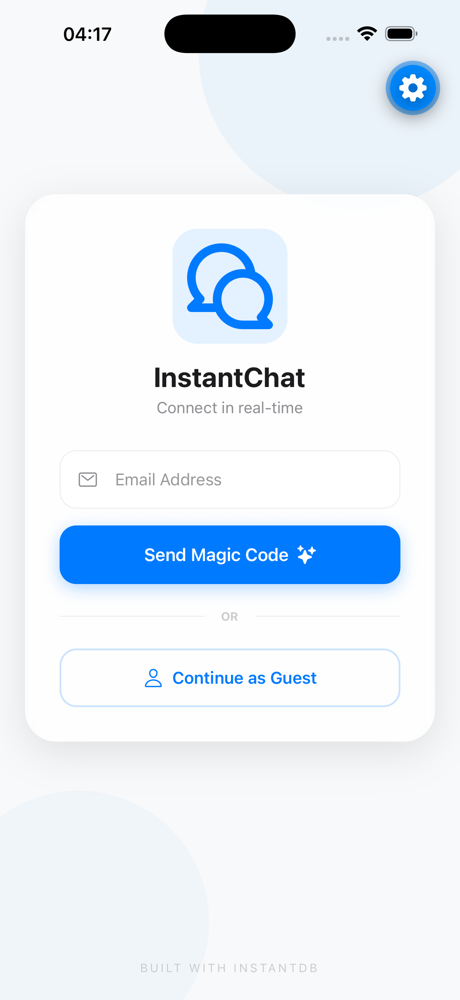
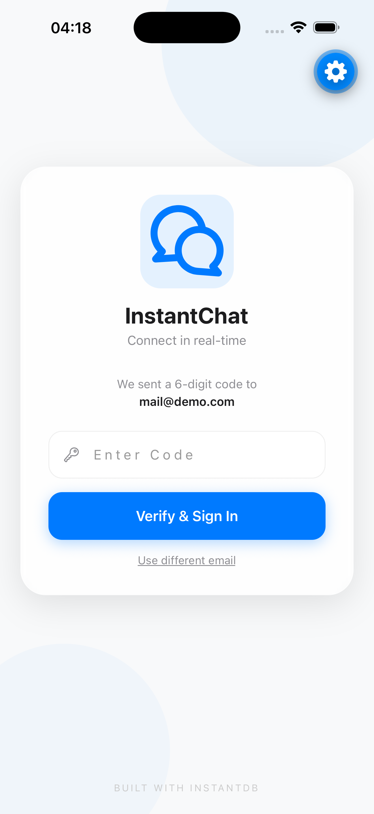
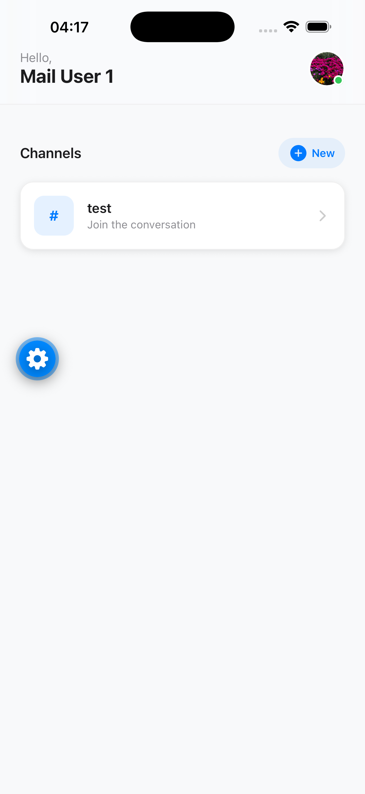
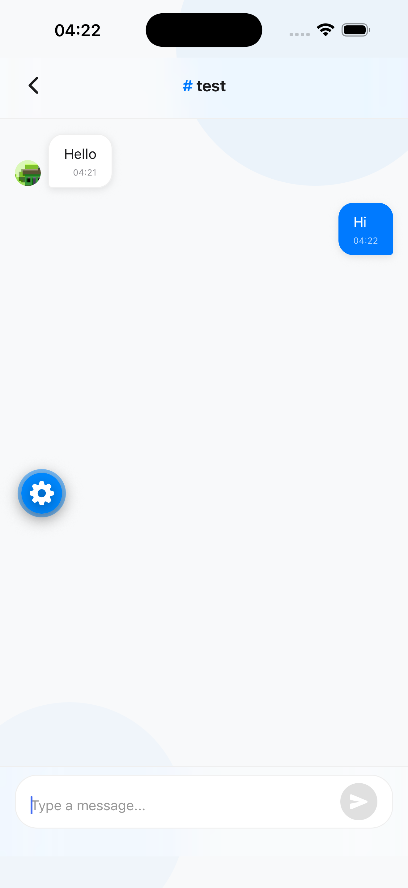

# RNRealtimeChatApp - Proof of Concept (PoC)

[English](#english) | [Türkçe](#türkçe)

---

<a name="english"></a>
## English

A real-time messaging application built with React Native and InstantDB.

### Screens

| Login | Verify Code | Home | Chat |
| :---: | :---: | :---: | :---: |
|  |  |  |  |

### Technologies Used

*   **Framework**: [React Native](https://reactnative.dev/) + [Expo](https://expo.dev/)
*   **Navigation**: [Expo Router](https://docs.expo.dev/router/introduction/)
*   **Database, Auth & Storage**: [InstantDB](https://www.instantdb.com/)
*   **Animations**: [React Native Reanimated](https://docs.expo.dev/versions/latest/sdk/reanimated/)
*   **Visual Effects**: [Expo Blur](https://docs.expo.dev/versions/latest/sdk/blurview/)
*   **Vector Animations**: [Rive](https://rive.app/) (Animation library)
*   **Media Management**: expo-image-picker & expo-image-manipulator

### Project Structure

#### Screens
1.  **Auth**: Login and registration interface using InstantDB Auth.
2.  **Home**: Channel list and new channel creation.
3.  **Chat**: Real-time messaging with individual channels.
4.  **Profile**: Identity and avatar management.

### Installation

```bash
bun install
bunx expo start -c
```

---

<a name="türkçe"></a>
## Türkçe

React Native ve InstantDB ile geliştirilmiş gerçek zamanlı mesajlaşma uygulaması.

### Ekran Görüntüleri

| Giriş | Doğrulama | Ana Ekran | Sohbet |
| :---: | :---: | :---: | :---: |
|  |  |  |  |

### Kullanılan Teknolojiler

*   **Çatı (Framework)**: [React Native](https://reactnative.dev/) + [Expo](https://expo.dev/)
*   **Navigasyon**: [Expo Router](https://docs.expo.dev/router/introduction/)
*   **Veritabanı, Auth & Depolama**: [InstantDB](https://www.instantdb.com/)
*   **Animasyonlar**: [React Native Reanimated](https://docs.expo.dev/versions/latest/sdk/reanimated/)
*   **Görsel Efektler**: [Expo Blur](https://docs.expo.dev/versions/latest/sdk/blurview/)
*   **Vektörel Animasyonlar**: [Rive](https://rive.app/) (Animasyon kütüphanesi)
*   **Medya Yönetimi**: expo-image-picker & expo-image-manipulator

### Proje Yapısı

#### Ekranlar
1.  **Giriş**: InstantDB Auth destekli giriş ve kayıt arayüzü.
2.  **Ana Ekran**: Kanal listesi ve yeni kanal oluşturma.
3.  **Sohbet**: Kanallara özel gerçek zamanlı mesajlaşma.
4.  **Profil**: Kimlik ve profil fotoğrafı yönetimi.

### Kurulum

```bash
bun install
bunx expo start -c
```

---
*This project is a Proof of Concept (PoC) work. / Bu proje bir Proof of Concept (PoC) çalışmasıdır.*
